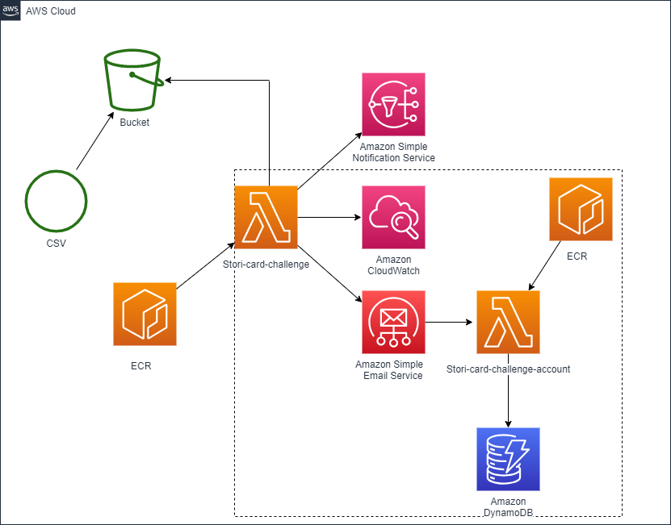

# Stori card Challenge

This stori-card-challenge lambda where a Csv is got from S3 and the transactions are processed.

## Installation

To install this project in aws environment you need:

1) S3 configuration transactions-bucket-stori-card-challenge (bucket)
2) Upload Csv, there is an example in /resources directory
3) Create Lambda in aws console configured with Docker image we are going to upload next
4) Push Dockerfile 
```bash 

## Build image

docker build -t stori-card-challenge-account-lambda:latest .

## Tag image

docker tag stori-card-challenge-account-lambda:latest 767397698520.dkr.ecr.us-east-1.amazonaws.com/account-images

## Push Image to ECR service
docker push 767397698520.dkr.ecr.us-east-1.amazonaws.com/account-images
```
5) Need to create SES identities for the emails in aws console (In the next version there is going to be a feature to create them automatically)

6) Create simple SNS Topic called "CreateUserAccountTopic" and in aws.json and replace Arn in aws_json


notes: 
- I am using us-east-1 region
- The api gateway lambda invocation in account is commented because it was used for a POC and then I added the SNS.




